# UTP Class (frontend no oficial)

Frontend en React + TypeScript + Vite para el campus virtual de la UTP (`class.utp.edu.pe`).

> **Aviso:** este es un proyecto **no oficial** y con fines **exclusivamente educativos**. No está
> afiliado, respaldado ni mantenido por la UTP. No incluye credenciales; cada quien usa su propia
> sesión.

## Secciones soportadas

- **Mis cursos** — cursos del periodo vigente (o de otro periodo con el selector), con progreso,
  docente, aula y modalidad.
- **Detalle del curso** — Sílabo, Contenido por semanas, Evaluaciones, Tareas, Foros, Notas,
  Anuncios y Zoom, más el asistente virtual.
- **Calendario** — vista mensual con clases de Zoom y fechas de entrega de tareas, foros y
  evaluaciones.
- **Actividades** — listado de tareas, foros y evaluaciones con filtros por estado.
- **Calificaciones** — promedio general y notas de todos los cursos del periodo, con filtros por tipo.
- **Mensajes** — conversaciones con tus docentes: enviar mensajes, iniciar chats nuevos y
  previsualizar adjuntos (imágenes, PDF, video, audio y documentos de Office).
- **Messenger flotante** — botón con el conteo de no leídos que abre tus chats desde cualquier página.

Aún en construcción: Recursos y Configuración.

## Capturas

### Login

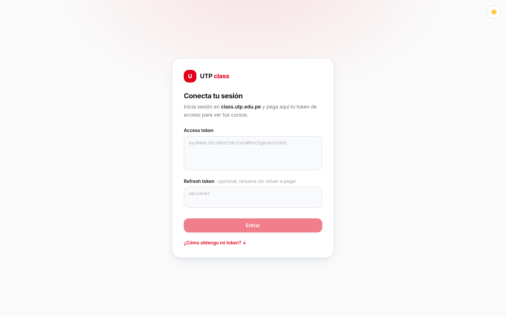

### Mis cursos

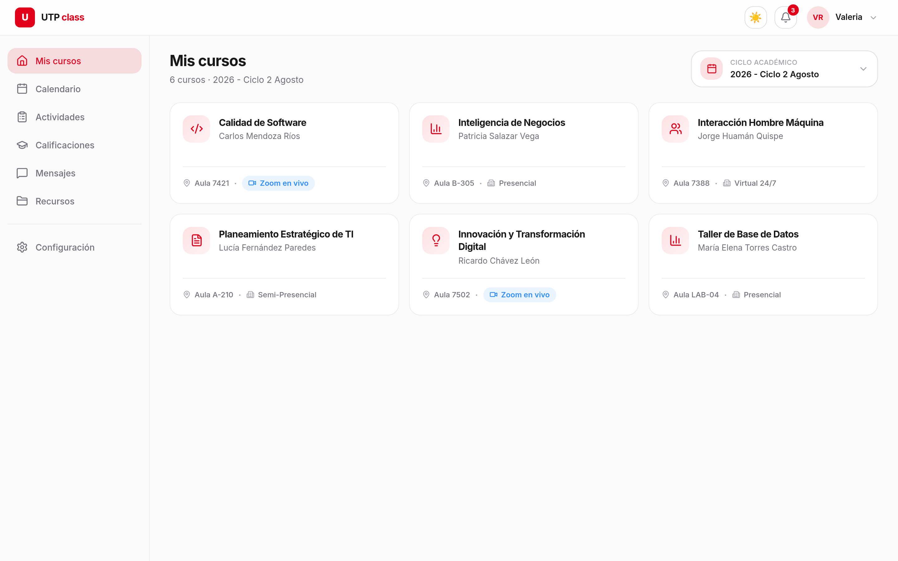

### Curso · Contenido

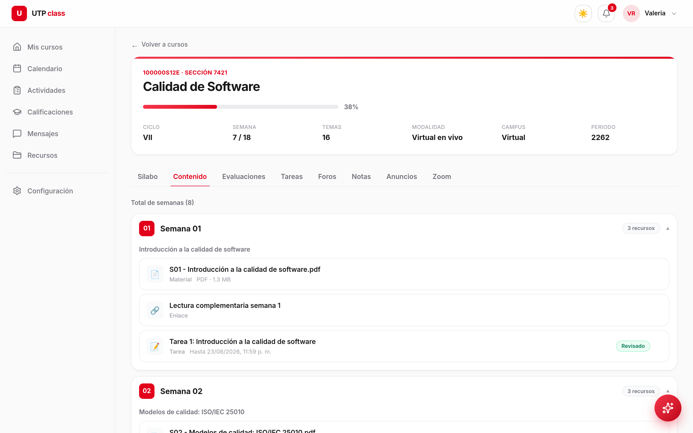

### Curso · Tareas

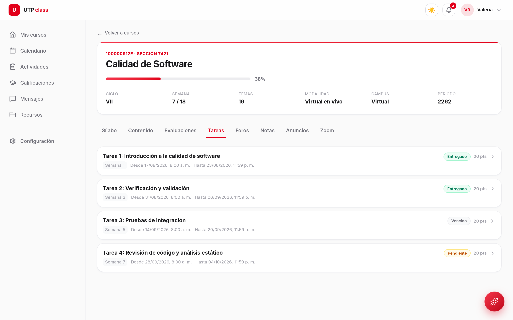

### Detalle de tarea

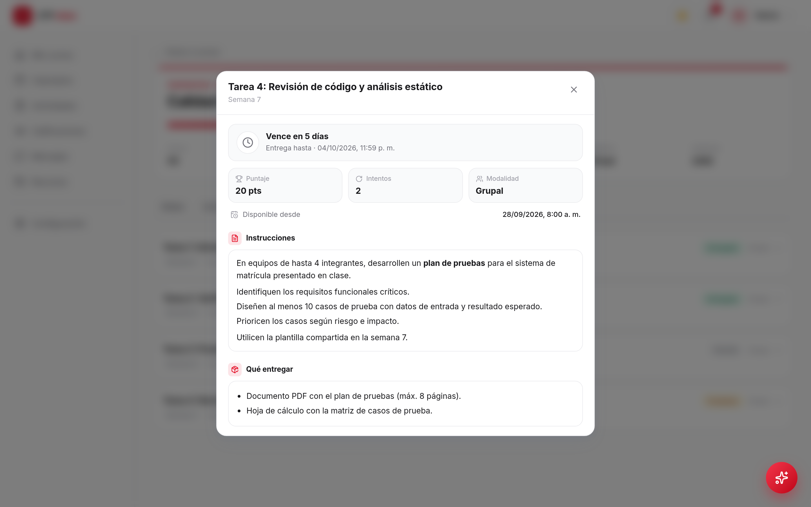

### Curso · Notas

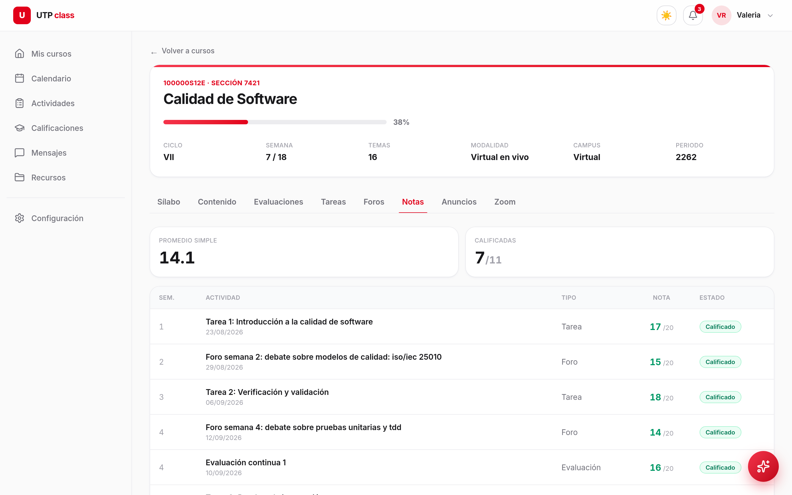

### Curso · Anuncios

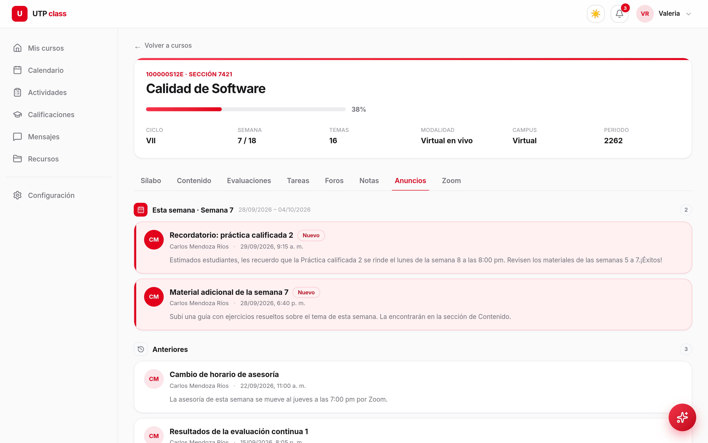

### Asistente virtual

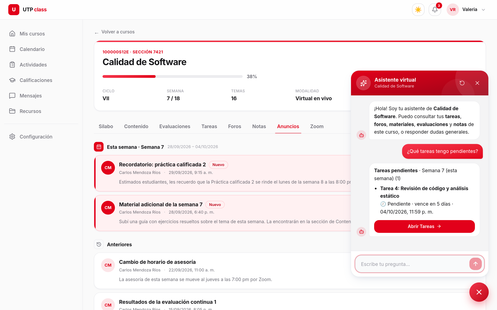

### Calendario

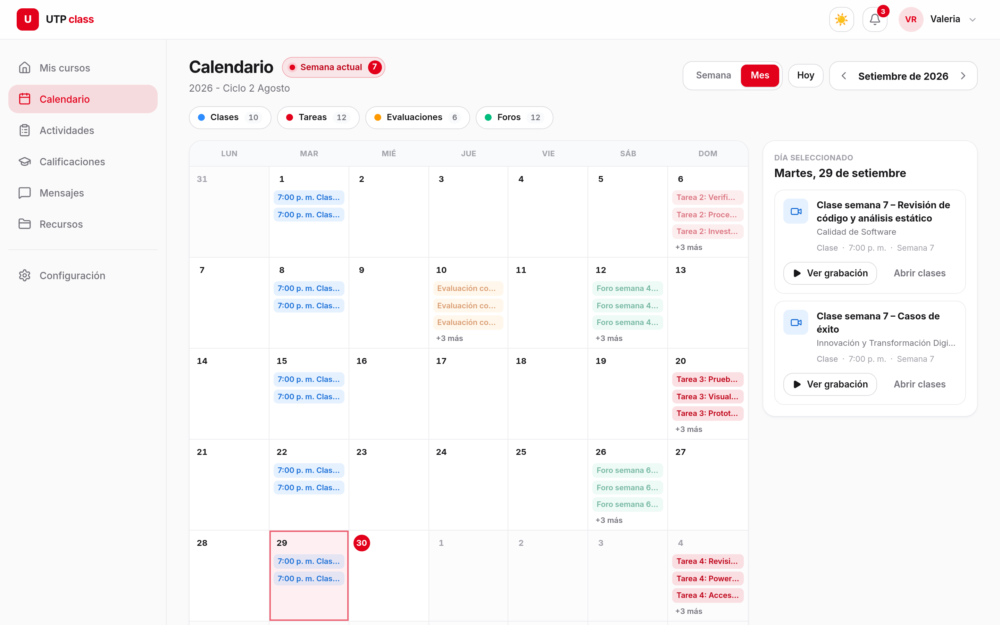

### Actividades

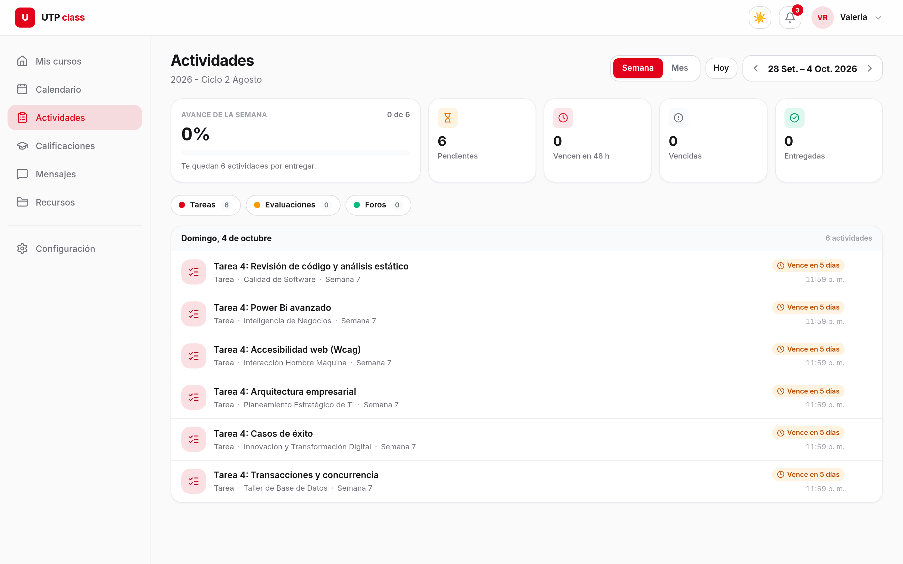

### Calificaciones

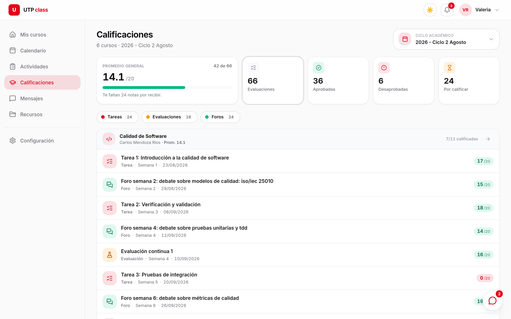

### Mensajes

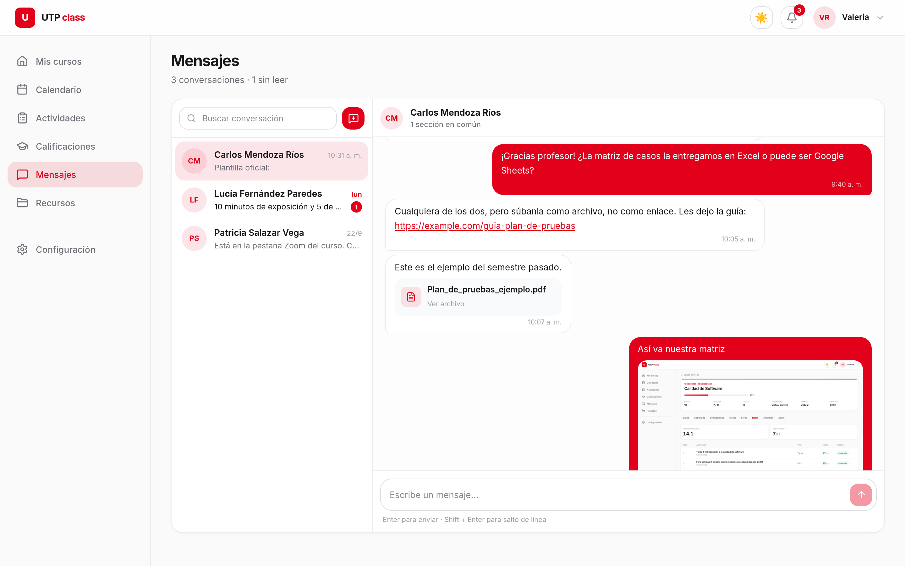

### Vista previa de adjuntos

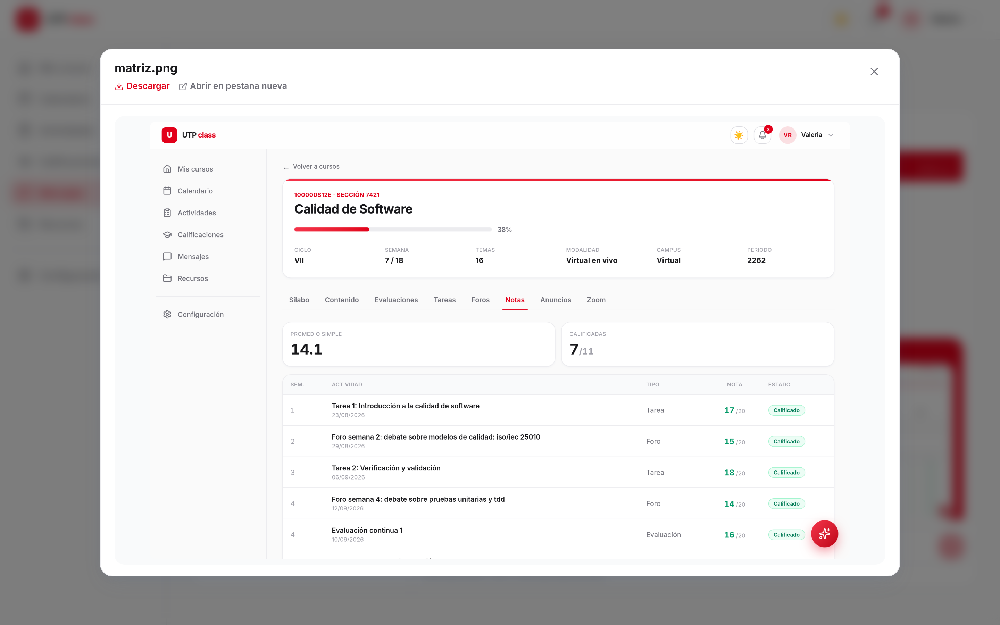

### Messenger flotante

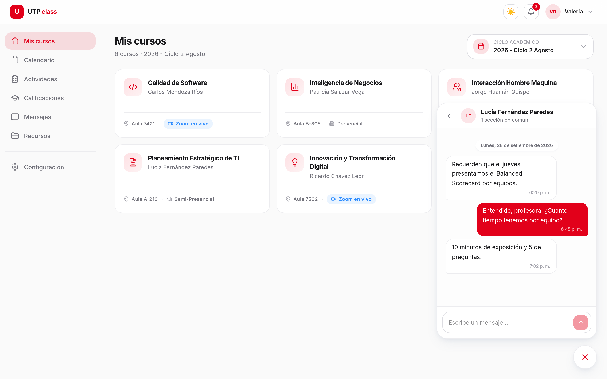

## Stack

- **Vite + React 18 + TypeScript**
- **Tailwind CSS v4** (config CSS-first, tokens en `src/index.css`) con **modo claro/oscuro**
- **Framer Motion** para animaciones (stagger, indicador de pestañas con `layoutId`, panel del
  asistente con spring). Curvas/tiempos siguiendo la filosofía de diseño de Emil Kowalski.
- **react-router-dom** para el ruteo
- **axios** con interceptores para inyectar los headers de autenticacion y renovar el token

### Diseño

- Estética limpia tipo Linear/Vercel: neutros, espacio en blanco, rojo UTP como acento.
- **Shell con sidebar** (`src/components/Sidebar.tsx`) + topbar con toggle de tema, campana de
  notificaciones (badge con conteo real) y usuario. En móvil el sidebar es un drawer.
- **Cards de curso** con ícono por materia (`src/lib/courseIcon.ts`, lucide-react), menú kebab,
  barra de progreso, chips con íconos y glow de marca.
- Selector de ciclo académico como dropdown propio (`src/components/PeriodSelect.tsx`).
- Tema claro/oscuro con toggle (persiste en `localStorage`, sin flash inicial). Ver `src/lib/theme.tsx`.
- Íconos con **lucide-react**. Primitivos de UI en `src/components/ui.tsx`.
- Tokens semánticos (`--surface`, `--fg`, `--border`, escala `brand-*`) definidos en `src/index.css`.

## Correr

```bash
npm install
npm run dev      # http://localhost:5173
npm run build    # build de produccion
```

## Login (el token lo pones tu)

Los tokens en el `localStorage` de UTP estan cifrados, asi que la app pide tu **access token**:

1. Inicia sesion normalmente en `https://class.utp.edu.pe`.
2. Abre la consola del navegador (F12 → Console), pega el snippet que aparece en la pantalla de
   login (**¿Como obtengo mi token?**) y presiona Enter.
3. Haz clic en cualquier curso/menu: el token se copia solo al portapapeles.
4. Pegalo en la app. (Opcional: pega tambien el refresh token para renovar sin volver a pegar.)

La app decodifica el JWT, deriva tu `User-Id` (`uuidv5` del email) y guarda la sesion en
`localStorage`. El access token dura 24h.
